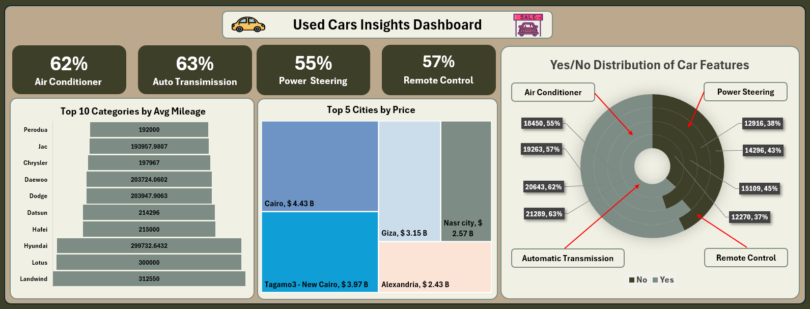
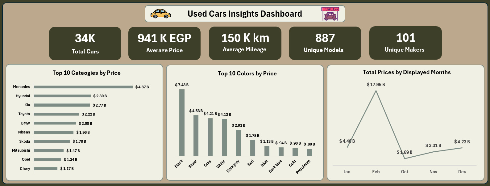

# 🏎️ Used Cars in Egypt – Scraped Dataset

  
  
  

---

## 📊 Overview

This dataset contains **over 33,500 records** of used cars listed for sale in **Egypt**, scraped from [Hatla2ee](https://eg.hatla2ee.com/en/car).  
It includes detailed information such as **car name, make, model, price, mileage, transmission, fuel type, and more**.

You can use this dataset for:

- 🔍 **Exploratory Data Analysis (EDA)**
- 🤖 **Machine Learning (ML) / Deep Learning (DL)**
- 📈 **Dashboard or Visualization Projects**
- 🧹 **Data Cleaning and Preprocessing Practice**

---

## 🧠 Dataset Details

| Feature | Description |
|----------|--------------|
| **Records** | 33,500+ |
| **Source** | [Hatla2ee Egypt](https://eg.hatla2ee.com/en/car) |
| **Scraping Tools** | `Selenium`, `BeautifulSoup` |
| **Key Columns** | `Name`, `Make`, `Model`, `Price`, `Mileage`, `Transmission`, `Fuel Type`, `City`, `Features`, `Year` |

> ⚠️ Note: Some data may contain missing values or inconsistencies — this makes it **perfect for hands-on data cleaning practice**.

---

## 📊 Example Dashboards

### 🔹 Used Cars Insights Dashboard

- Top car brands and models by **price** and **mileage**
- **Feature distributions** (Air Conditioner, Power Steering, etc.)
- **Most expensive cities** and **color trends**
- Monthly **price evolution** analysis

---

## 🧰 Tools & Libraries

- 🐍 **Python**  
- 🕸️ **Selenium**, **BeautifulSoup** (Web Scraping)  
- 📊 **Pandas**, **Matplotlib**, **Plotly** (Data Analysis & Visualization)  

---

## 🔗 Useful Links

| Resource | Link |
|-----------|------|
| 🧾 **Dataset on Kaggle** | [Used Cars for Sale in Egypt](https://www.kaggle.com/datasets/abdelrahmanahmed110/used-cars-for-sale-in-egypt) |
| 🧠 **Scraping Code** | [Hatla2ee Scraper on GitHub](https://github.com/Abdelrahman47-code/Web-Scraping-Projects/blob/main/hatla2ee_scraped_data.py) |
| 🌐 **Data Source** | [Hatla2ee Egypt](https://eg.hatla2ee.com/en/car) |

---

## 🧑‍💻 Author

**Abdelrahman Ahmed**  
_Data Scientist • Web Developer • Python Enthusiast_  

---
⭐ **If you find this dataset useful, please give this repo a star!**
